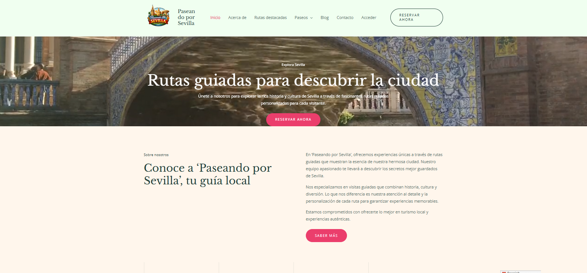
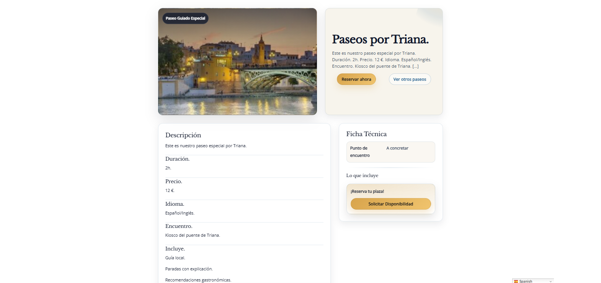
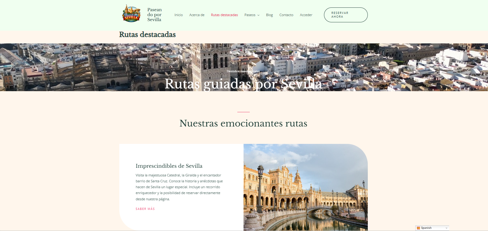

# Paseando por Sevilla — Web de reservas de paseos (WordPress)

Este proyecto consiste en el desarrollo de una página web turística construida con WordPress que permite mostrar diferentes paseos por Sevilla y facilitar su reserva por parte de los usuarios.

El objetivo del proyecto ha sido aprender a utilizar WordPress como un CMS personalizado, creando tipos de contenido propios, plantillas específicas y funcionalidades adicionales mediante plugins.

Además, este proyecto forma parte de mi aprendizaje como desarrollador web y ha sido pensado también como parte de mi portfolio profesional.

---

# ¿Qué hace este proyecto?

La web permite:

- Mostrar diferentes paseos turísticos organizados en una estructura clara.
- Visualizar cada paseo en una página propia con información detallada.
- Listar automáticamente todos los paseos disponibles.
- Reservar cada paseo mediante un sistema de reservas integrado.
- Traducir la página a varios idiomas.
- Contactar directamente con la empresa mediante WhatsApp.
- Permitir acceso de usuarios mediante sistema de login.

---

# Tecnologías y herramientas utilizadas

## CMS

WordPress

## Lenguajes

PHP  
HTML  
CSS  

## Plugins utilizados

| Plugin | Función |
|---|---|
| Simply Schedule Appointments | Sistema de reservas para cada paseo |
| GTranslate | Traducción automática a varios idiomas |
| Click to Chat | Botón de contacto directo con WhatsApp |
| Ultimate Member | Sistema de registro y login de usuarios |

---

# Conceptos técnicos aplicados

Durante el desarrollo del proyecto se han puesto en práctica varios conceptos importantes de WordPress:

- Creación de Custom Post Types (CPT) para gestionar los paseos.
- Uso de la jerarquía de plantillas de WordPress.
- Creación de plantillas personalizadas como `single-paseo.php`.
- Generación automática de listados de contenido.
- Encolado de archivos CSS independientes desde `functions.php`.
- Uso básico de hooks de WordPress.
- Integración de diferentes plugins para ampliar funcionalidades.

Estos conceptos me han permitido comprender mejor cómo WordPress puede transformarse en un CMS flexible y adaptable a diferentes proyectos.

---

# Capturas del proyecto

## Página principal



## Listado automático de paseos



## Página de reserva de paseo



---

# Estructura del proyecto

La estructura principal del repositorio es la siguiente:

```
paseos-wordpress/
├─ README.md
├─ .gitignore
├─ docs/
│  └─ img/
│     ├─ home.png
│     ├─ listado-paseos.png
│     └─ rutas.png
└─ wp-content/
   └─ themes/
      └─ tema-hijo/
         ├─ style.css
         ├─ functions.php
         ├─ single-paseo.php
         ├─ archive-paseo.php
         └─ assets/
            └─ css/
```

---

# Instalación del proyecto

Para probar el proyecto en local se pueden seguir los siguientes pasos:

1. Instalar WordPress en local (por ejemplo con LocalWP, XAMPP o MAMP).

2. Copiar el tema hijo dentro de la carpeta `wp-content/themes/`.

3. Activar el tema desde el panel de administración de WordPress.

4. Instalar y activar los plugins utilizados en el proyecto:

- Simply Schedule Appointments
- GTranslate
- Click to Chat
- Ultimate Member

5. Crear varios paseos de prueba para comprobar el funcionamiento del listado y las plantillas.

---

# Aprendizaje y retos del proyecto

Este proyecto ha supuesto un paso importante en mi aprendizaje de WordPress.

Uno de los principales retos fue entender cómo funciona la jerarquía de plantillas de WordPress y cómo crear una plantilla personalizada para mostrar cada paseo.

También tuve que aprender a:

- Encolar correctamente archivos CSS desde `functions.php`
- Crear un Custom Post Type para organizar el contenido
- Generar un listado automático de los paseos
- Integrar diferentes plugins sin que generaran conflictos

Durante el desarrollo cometí varios errores, especialmente al principio con las rutas de las plantillas y el encolado de estilos, pero poco a poco fui entendiendo mejor cómo funciona la estructura interna de WordPress.

Este proyecto me ayudó a comprender que WordPress no es solo un gestor de contenidos, sino una plataforma que puede adaptarse a muchos tipos de proyectos web.

---

# Mejoras futuras

Si continuara desarrollando este proyecto, me gustaría añadir algunas mejoras:

- Implementar un sistema de pago online para las reservas.
- Añadir filtros para buscar paseos por categoría o zona.
- Crear un panel de usuario donde ver reservas realizadas.
- Mejorar el diseño responsive para móviles.
- Optimizar el rendimiento de carga de la página.

---

# Conclusión

Este proyecto me ha permitido comprender cómo desarrollar una web funcional con WordPress combinando código propio y plugins.

Gracias a la creación de Custom Post Types, plantillas personalizadas y la integración de diferentes herramientas, he conseguido construir una web usable y preparada para mostrar contenido turístico de forma clara.

Además, este proyecto representa un paso más en mi aprendizaje como desarrollador web y en la construcción de mi portfolio profesional.